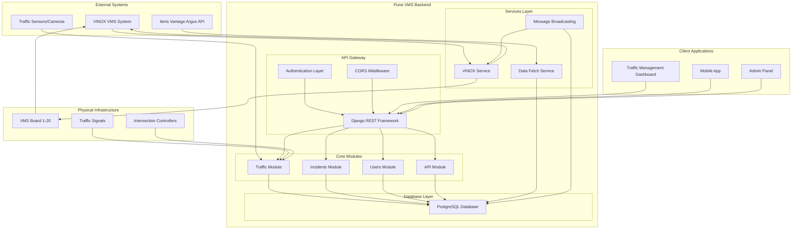
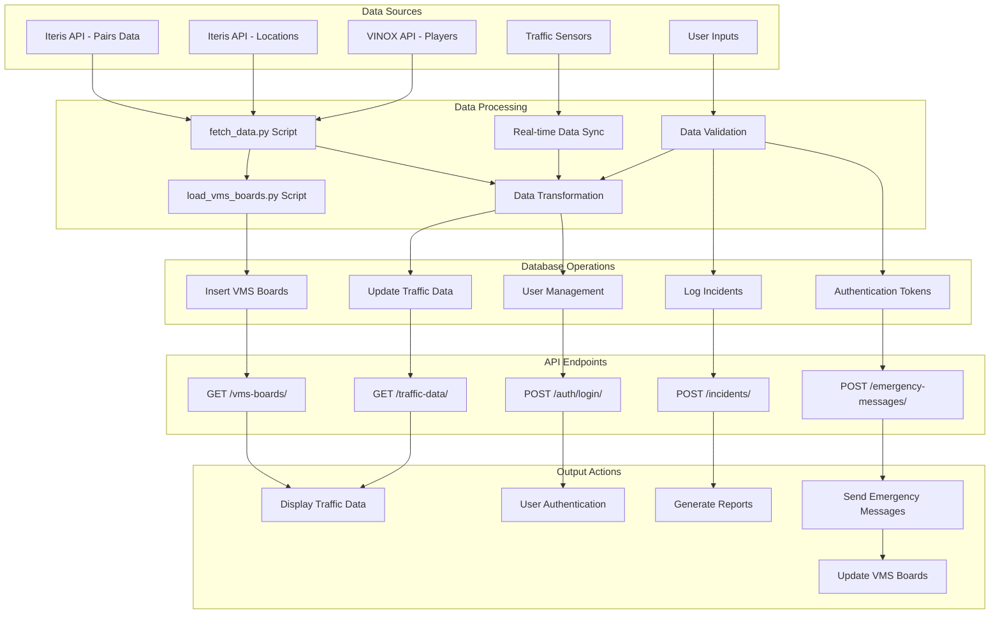
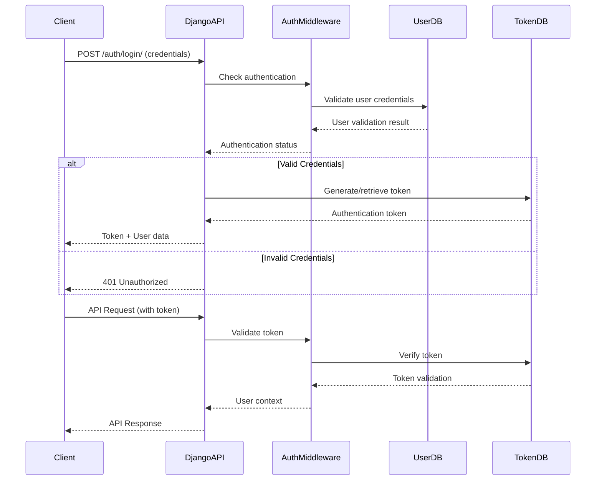
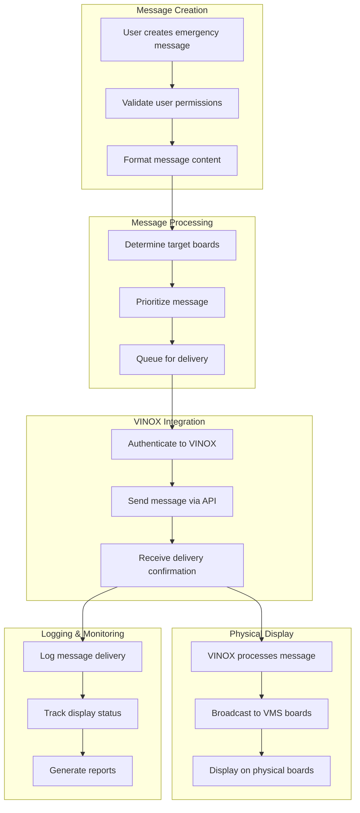
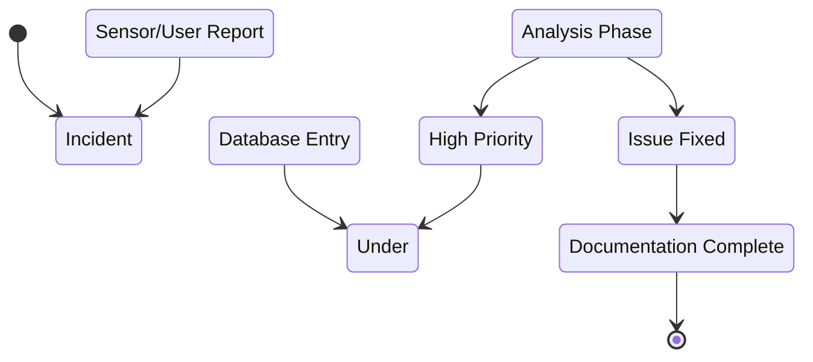
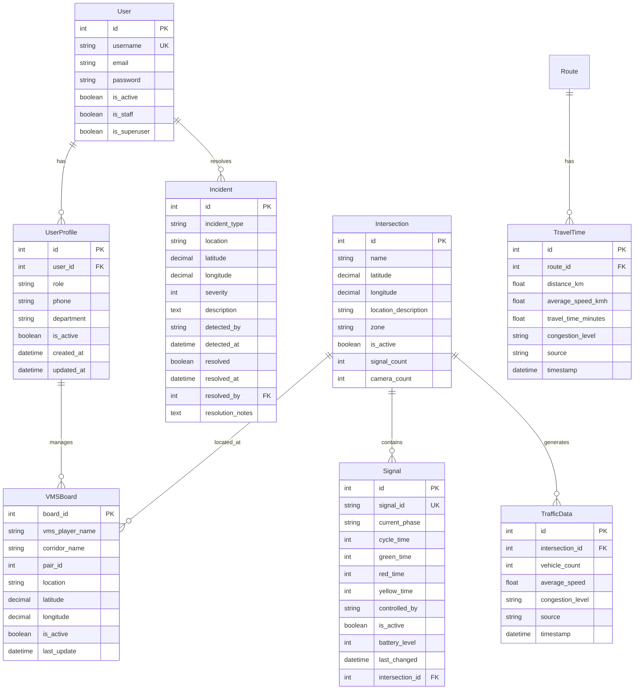
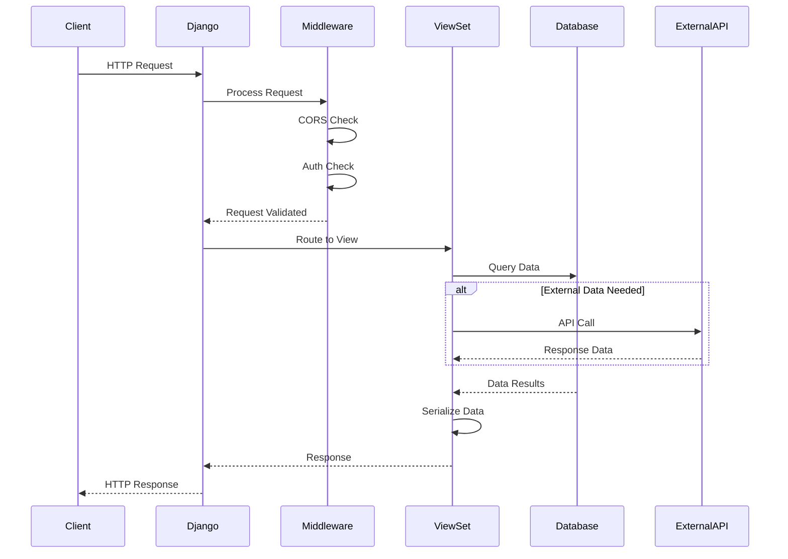
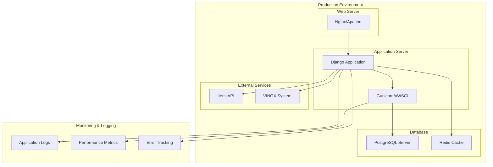

# Pune VMS System - Architecture Diagrams

## System Block Diagram

## Data Flow Diagram

## Authentication Flow Diagram

## Emergency Message Broadcasting Flow

## Incident Management Workflow

## Database Schema Relationships

## API Request-Response Flow

## Deployment Architecture

## Key System Components Summary

### 1. **Frontend Layer**
- Traffic Management Dashboard
- Mobile Applications
- Admin Control Panel

### 2. **API Gateway**
- Django REST Framework
- Authentication & Authorization
- CORS Handling
- Request Validation

### 3. **Business Logic Layer**
- Traffic Management Module
- Incident Management Module
- User Management Module
- External API Integration

### 4. **Data Layer**
- PostgreSQL Database
- Redis Caching
- File Storage

### 5. **External Integrations**
- Iteris Vantage Argus API
- VINOX VMS System
- Traffic Sensors

### 6. **Infrastructure**
- Web Servers
- Application Servers
- Database Servers
- Monitoring Systems

This architecture provides a scalable, maintainable, and robust system for managing Pune's Variable Message Sign infrastructure with real-time data processing and emergency response capabilities.
