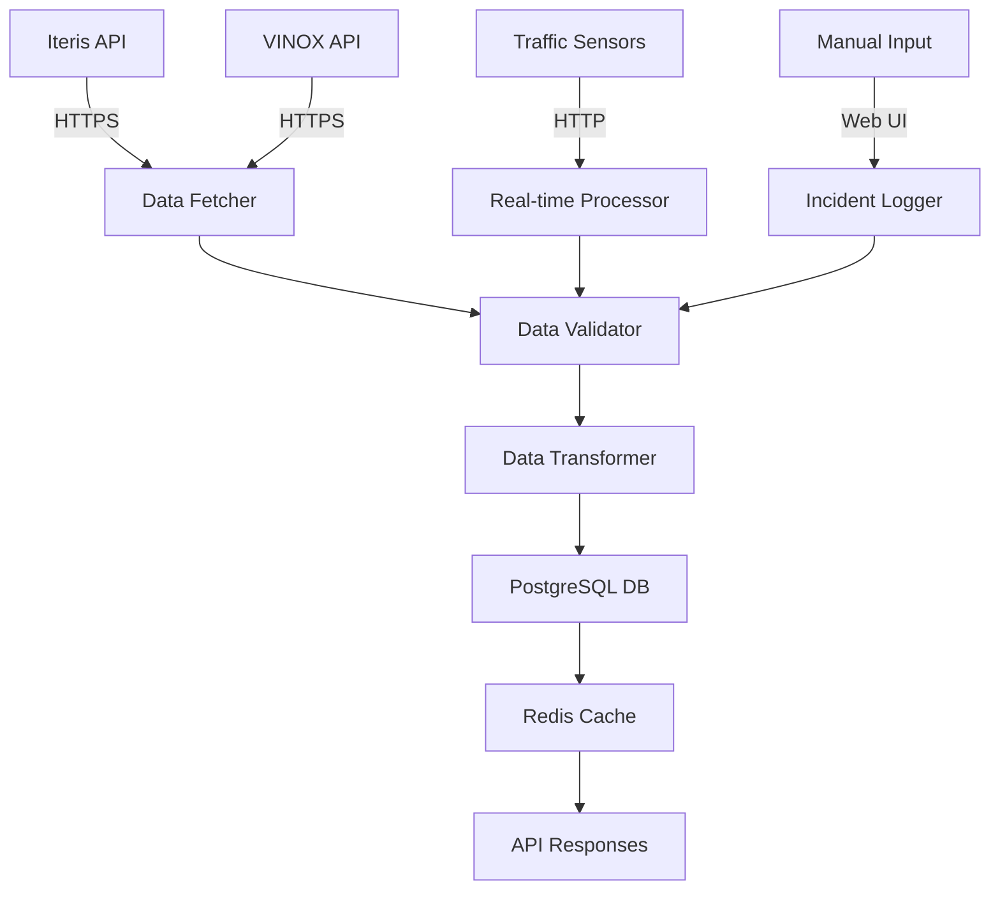
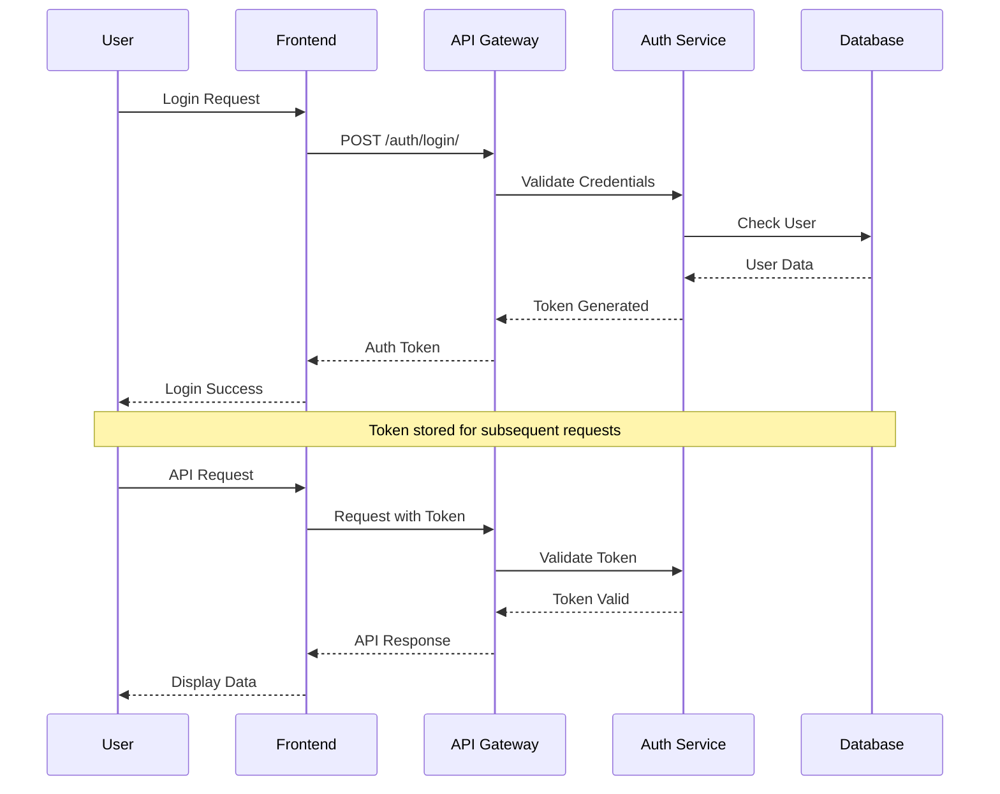
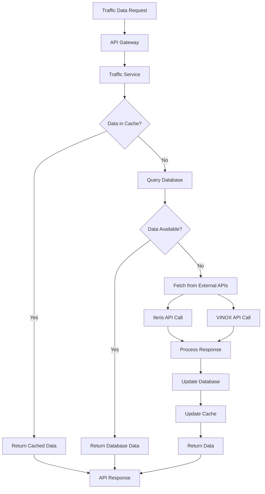
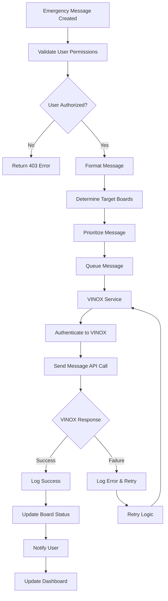
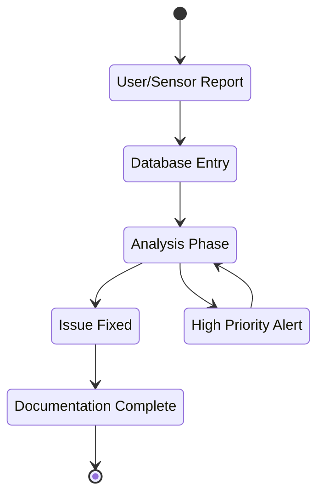

# Pune VMS System - Complete System Flow Documentation

## Executive Summary

The Pune VMS (Variable Message Sign) System is a comprehensive traffic management platform designed to monitor, control, and optimize traffic flow across Pune city through digital signage and real-time data integration.

## System Architecture Overview

### High-Level Block Diagram

```
┌─────────────────────────────────────────────────────────────────────────────────┐
│                           PUNE VMS SYSTEM                                     │
├─────────────────────────────────────────────────────────────────────────────────┤
│  ┌─────────────┐  ┌─────────────┐  ┌─────────────┐  ┌─────────────┐         │
│  │   CLIENTS   │  │   API GW    │  │   SERVICES  │  │  DATABASE   │         │
│  │             │  │             │  │             │  │             │         │
│  │ Web Dashboard│  │ Django REST │  │ Traffic Mgmt│  │ PostgreSQL  │         │
│  │ Mobile App  │  │ Framework   │  │ Incident Mgmt│  │             │         │
│  │ Admin Panel │  │ Auth Layer  │  │ User Mgmt   │  │ Redis Cache │         │
│  └─────────────┘  └─────────────┘  └─────────────┘  └─────────────┘         │
└─────────────────────────────────────────────────────────────────────────────────┘
                                    │
                                    ▼
┌─────────────────────────────────────────────────────────────────────────────────┐
│                        EXTERNAL INTEGRATIONS                                   │
├─────────────────────────────────────────────────────────────────────────────────┤
│  ┌─────────────┐  ┌─────────────┐  ┌─────────────┐  ┌─────────────┐         │
│  │ Iteris API  │  │ VINOX VMS   │  │ Traffic     │  │ VMS Boards  │         │
│  │ Vantage     │  │ System      │  │ Sensors     │  │ (Physical)  │         │
│  │ Argus       │  │             │  │ Cameras     │  │             │         │
│  └─────────────┘  └─────────────┘  └─────────────┘  └─────────────┘         │
└─────────────────────────────────────────────────────────────────────────────────┘
```

## Detailed Component Flow

### 1. Data Collection Flow



**Data Sources:**
- **Iteris Vantage Argus**: Traffic corridor pairs, location data
- **VINOX VMS System**: Digital signage player information
- **Traffic Sensors**: Real-time traffic flow data
- **Manual Input**: User-reported incidents and messages

### 2. Authentication & Authorization Flow



### 3. Traffic Management Flow



### 4. Emergency Message Broadcasting Flow



### 5. Incident Management Workflow



## Database Schema and Relationships

### Core Entity Relationships

```
┌─────────────┐    ┌─────────────┐    ┌─────────────┐
│    User     │    │ UserProfile │    │   Incident  │
├─────────────┤    ├─────────────┤    ├─────────────┤
│ id (PK)     │◄───┤ user_id (FK)│    │ id (PK)     │
│ username    │    │ role        │    │ location    │
│ email       │    │ phone       │    │ severity    │
│ password    │    │ department  │    │ detected_by │
└─────────────┘    └─────────────┘    │ resolved_by │◄─────┘
                                        └─────────────┘

┌─────────────┐    ┌─────────────┐    ┌─────────────┐
│ Intersection│    │   Signal    │    │  TrafficData│
├─────────────┤    ├─────────────┤    ├─────────────┤
│ id (PK)     │◄───┤ intersection│    │ id (PK)     │
│ name        │    │ _id (FK)    │    │ intersection│
│ latitude    │    │ signal_id   │    │ _id (FK)    │
│ longitude   │    │ current_phase│   │ vehicle_count│
│ zone        │    │ cycle_time  │    │ avg_speed   │
└─────────────┘    └─────────────┘    │ timestamp   │
                                        └─────────────┘

┌─────────────┐    ┌─────────────┐    ┌─────────────┐
│   VMSBoard  │    │    Route     │    │ TravelTime  │
├─────────────┤    ├─────────────┤    ├─────────────┤
│ board_id(PK)│    │ id (PK)     │    │ id (PK)     │
│ player_name │    │ start_loc   │    │ route_id(FK)│
│ corridor_id │    │ end_loc     │    │ distance_km │
│ latitude    │    │ distance    │    │ travel_time │
│ longitude   │    │ description │    │ timestamp   │
└─────────────┘    └─────────────┘    └─────────────┘
```

## API Endpoint Structure

### Traffic Management APIs

```
/api/traffic/
├── vms-boards/
│   ├── GET /                    # List all VMS boards
│   ├── GET /{id}/              # Get specific board
│   └── POST /{id}/messages/    # Send message to board
├── intersections/
│   ├── GET /                    # List intersections
│   ├── GET /{id}/              # Get intersection details
│   └── GET /{id}/signals/      # Get intersection signals
├── signals/
│   ├── GET /                    # List all signals
│   ├── GET /{id}/              # Get signal details
│   └── PUT /{id}/              # Update signal state
├── traffic-data/
│   ├── GET /                    # Get traffic data
│   └── POST /                   # Report traffic data
├── incidents/
│   ├── GET /                    # List incidents
│   ├── POST /                   # Create incident
│   ├── PUT /{id}/              # Update incident
│   └── DELETE /{id}/           # Delete incident
└── auth/
    ├── POST /login/            # User authentication
    ├── POST /logout/           # User logout
    ├── POST /forgot-password/  # Password recovery
    └── POST /reset-password/   # Password reset
```

## External Integration Details

### Iteris Vantage Argus Integration

```
Authentication: Bearer Token
Base URL: https://vantagearguscv.iteris.com

Endpoints:
├── /public-api/v1/pairs
│   ├── Method: GET
│   ├── Purpose: Fetch traffic corridor pairs
│   ├── Response: Array of pair objects
│   └── Frequency: Hourly sync
└── /public-api/v1/locations
    ├── Method: GET
    ├── Purpose: Fetch location data
    ├── Response: Array of location objects
    └── Frequency: Hourly sync
```

### VINOX VMS System Integration

```
Authentication: HTTP Basic + Bearer Token
Base URL: Configurable VINOX domain

Endpoints:
├── /adorvmsapi/authenticate
│   ├── Method: POST
│   ├── Purpose: Get authentication token
│   ├── Request: {username, password}
│   └── Response: {token}
├── /adorvmsapi/v1/players
│   ├── Method: GET
│   ├── Purpose: Fetch VMS player data
│   ├── Headers: Authorization: Bearer {token}
│   └── Response: Array of player objects
└── /adorvmsapi/v1/messages
    ├── Method: POST
    ├── Purpose: Send message to VMS boards
    ├── Request: {player_ids, message, priority}
    └── Response: {status, message_id}
```

## Performance and Scalability

### Caching Strategy

```
Cache Hierarchy:
├── L1: Application Cache (Django Cache Framework)
│   ├── User sessions
│   ├── Authentication tokens
│   └── Configuration data
├── L2: Redis Cache
│   ├── Frequently accessed VMS board data
│   ├── Real-time traffic information
│   └── API response caching
└── L3: Database Query Cache
    ├── Intersection data
    ├── Historical traffic data
    └── Incident reports
```

### Database Optimization

```
Indexing Strategy:
├── Primary Keys: All tables have auto-increment primary keys
├── Foreign Keys: Indexed for faster joins
├── Timestamp Fields: Indexed for time-based queries
├── Location Fields: Geospatial indexes for geographic queries
└── Status Fields: Indexed for filtering active/inactive records

Query Optimization:
├── select_related: For forward relationships
├── prefetch_related: For reverse relationships
├── Database-level pagination: LIMIT/OFFSET
└── Query result caching: Frequently executed queries
```

## Security Implementation

### Authentication Layers

```
Security Stack:
├── Network Layer
│   ├── Firewall rules
│   ├── SSL/TLS encryption
│   └── VPN access for admin
├── Application Layer
│   ├── Django security middleware
│   ├── CSRF protection
│   ├── XSS protection
│   └── SQL injection prevention
├── API Layer
│   ├── Token-based authentication
│   ├── Rate limiting
│   ├── API key management
│   └── CORS policies
└── Data Layer
    ├── Database encryption
    ├── Environment variable protection
    └── Backup encryption
```

### Access Control Matrix

```
User Roles:
├── Administrator
│   ├── Full system access
│   ├── User management
│   ├── System configuration
│   └── Emergency message broadcasting
├── Operator
│   ├── Traffic monitoring
│   ├── Incident management
│   ├── Message broadcasting
│   └── Report generation
└── Viewer
    ├── Read-only access
    ├── Dashboard viewing
    ├── Report access
    └── Limited data export
```

## Monitoring and Maintenance

### System Monitoring

```
Monitoring Components:
├── Application Metrics
│   ├── Response times
│   ├── Error rates
│   ├── Throughput
│   └── Active users
├── Infrastructure Metrics
│   ├── CPU usage
│   ├── Memory usage
│   ├── Disk I/O
│   └── Network latency
├── Business Metrics
│   ├── Active VMS boards
│   ├── Message delivery rates
│   ├── Incident resolution times
│   └── System uptime
└── External API Health
    ├── Iteris API status
    ├── VINOX API status
    ├── Response times
    └── Error rates
```

### Backup and Recovery

```
Backup Strategy:
├── Database Backups
│   ├── Daily full backups
│   ├── Hourly incremental backups
│   ├── Point-in-time recovery
│   └── Cross-region replication
├── File System Backups
│   ├── Configuration files
│   ├── Log files
│   ├── Static assets
│   └── Media files
└── Disaster Recovery
    ├── Multi-AZ deployment
    ├── Automatic failover
    ├── Health checks
    └── Recovery procedures
```

## Deployment Architecture

### Production Environment

```
Load Balancer (Nginx/HAProxy)
    │
    ▼
Web Servers (Multiple Instances)
    │
    ▼
Application Servers (Django + Gunicorn)
    │
    ▼
┌─────────────┬─────────────┬─────────────┐
│ PostgreSQL   │ Redis Cache │ File Storage│
│ (Primary)    │ (Cluster)   │ (S3/NFS)    │
└─────────────┴─────────────┴─────────────┘
    │
    ▼
Read Replicas (PostgreSQL)
    │
    ▼
Analytics & Reporting
```

This comprehensive system flow documentation provides a complete understanding of the Pune VMS System's architecture, data flow, security implementation, and operational aspects, ensuring robust traffic management capabilities for Pune's smart city infrastructure.
