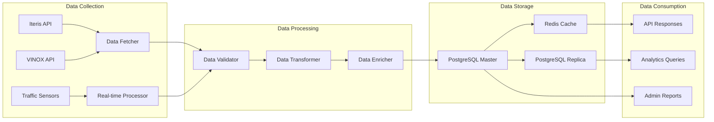
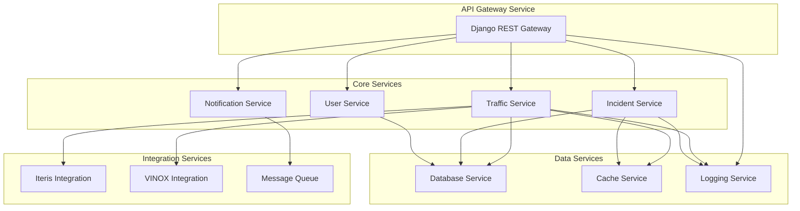
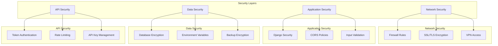
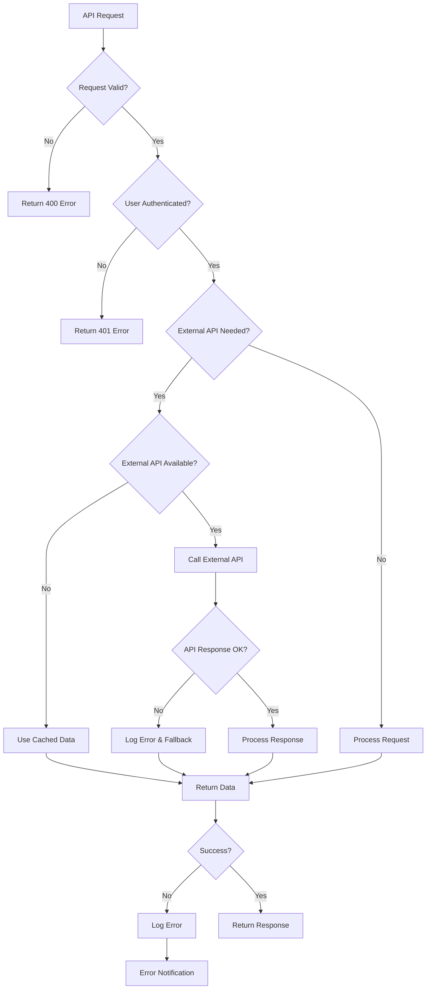
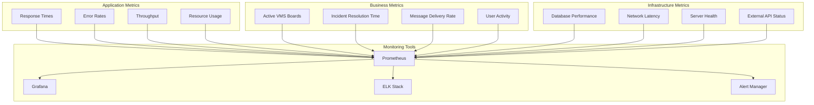
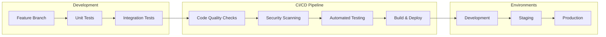

# Pune VMS System - Technical Implementation Details

## Component Interactions Matrix

| Component | Input Source | Output Destination | Protocol | Frequency |
|-----------|-------------|-------------------|----------|-----------|
| fetch_data.py | Iteris API, VINOX API | PostgreSQL Database | HTTPS | Scheduled/Hourly |
| load_vms_boards.py | Static Data | PostgreSQL Database | Local | One-time/Updates |
| Traffic API Views | Client Requests | JSON Response | HTTP/REST | Real-time |
| Auth Service | Login Credentials | JWT Token | HTTP/POST | Per Session |
| VINOX Service | Emergency Messages | VMS Boards | HTTPS API | On-demand |
| Incident Logger | User/Sensor Reports | Database | HTTP/POST | Real-time |

## Data Pipeline Architecture

## Microservices Communication Pattern

## Security Architecture

## Error Handling and Recovery Flow

## Performance Optimization Strategies

### Database Optimization
- **Indexing Strategy**: Primary keys on all tables, indexes on frequently queried fields
- **Query Optimization**: Using `select_related` and `prefetch_related` for complex queries
- **Connection Pooling**: Database connection pool for efficient resource usage
- **Read Replicas**: Separate read replicas for analytics queries

### Caching Strategy
- **Redis Caching**: Frequently accessed data (VMS board status, traffic data)
- **Application Caching**: In-memory caching for configuration data
- **CDN Caching**: Static assets and API responses where appropriate

### API Performance
- **Pagination**: Page-based pagination for large datasets
- **Field Selection**: Allow clients to request specific fields only
- **Batch Processing**: Batch API calls for bulk operations
- **Compression**: GZIP compression for API responses

## Monitoring and Observability

## Scalability Considerations

### Horizontal Scaling
- **Application Servers**: Multiple Django instances behind load balancer
- **Database Sharding**: Geographic or functional database sharding
- **Microservices**: Breaking down into smaller, independent services

### Vertical Scaling
- **Resource Allocation**: CPU, Memory optimization
- **Database Optimization**: Query performance, indexing
- **Caching Layers**: Multi-level caching strategy

### Disaster Recovery
- **Database Backups**: Automated daily backups with point-in-time recovery
- **Redundancy**: Multi-AZ deployment for high availability
- **Failover**: Automatic failover mechanisms

## Development Workflow

## Technology Rationale

### Django Framework
- **Rapid Development**: Built-in admin interface, ORM, authentication
- **Security**: Built-in security features (CSRF, XSS protection)
- **Scalability**: Proven scalability in production environments
- **Ecosystem**: Rich ecosystem of packages and tools

### PostgreSQL Database
- **Performance**: Excellent performance for complex queries
- **Features**: Advanced features like JSON support, full-text search
- **Reliability**: ACID compliance and strong consistency
- **Scalability**: Read replicas and partitioning support

### Django REST Framework
- **API Development**: Rapid API development with serialization
- **Authentication**: Multiple authentication methods
- **Documentation**: Auto-generated API documentation
- **Flexibility**: Customizable views and permissions

This comprehensive architecture ensures the Pune VMS System is robust, scalable, and maintainable while providing real-time traffic management capabilities for the city's smart infrastructure.
